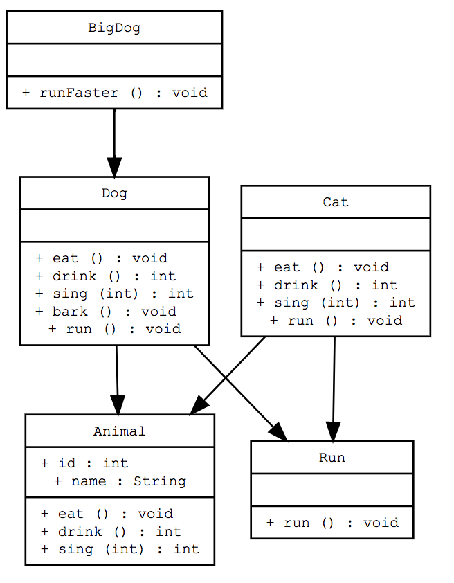

java uml 生成

## 使用方法

```
    python uml.py java_project_dir 
```

默认路径为“.”

## 输出

输出产生gv文件，用graphviz显示或者使用在线的版本http://www.webgraphviz.com/

将gv文件中的文本复制到网页中查看

只显示public的变量和方法

## Limit

因为使用简单的正则表达式做的，所以无法递归识别内部class，目前只能处理java文件中只用一个public class的情况

## TODO

1. 改进显示
2. 标识接口


## Example 


